# Eventora

Smart College Event Management App

## Splash Screen

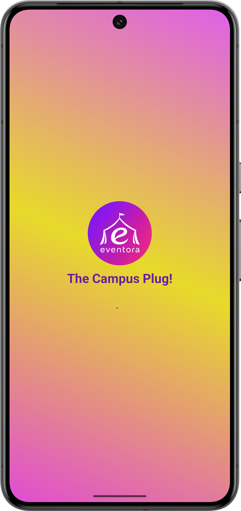
 
## Welcome Screen

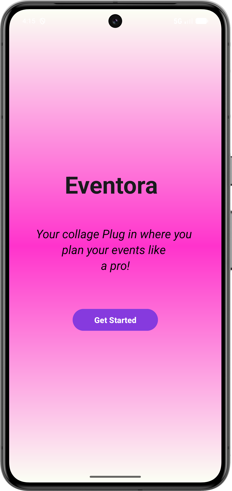

## login Screen

## Register Screen

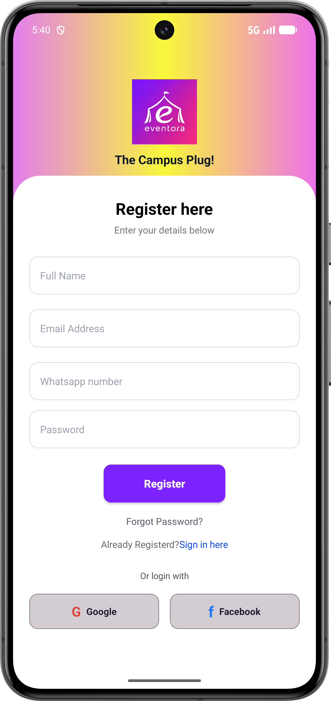

## sidebar 

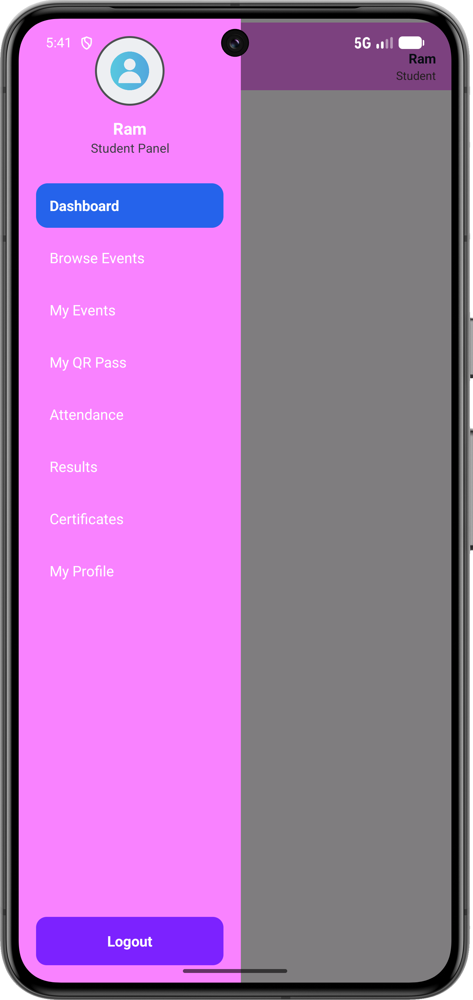

## TopBar

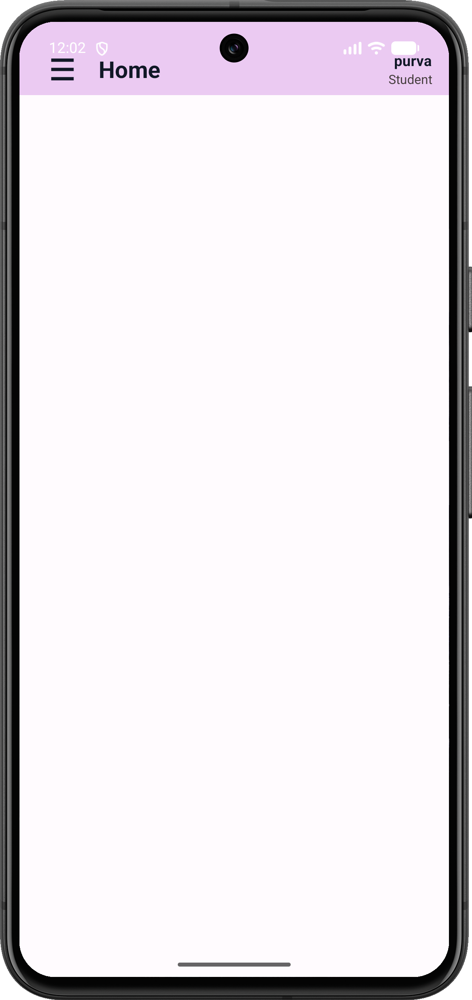

## Admin Login

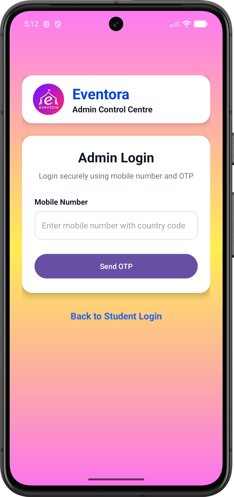

## OTP Dialog

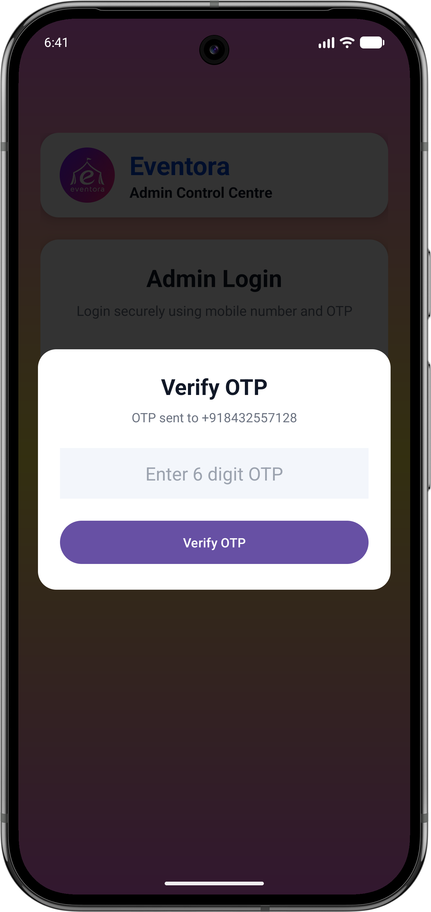

## Admin Dashboard

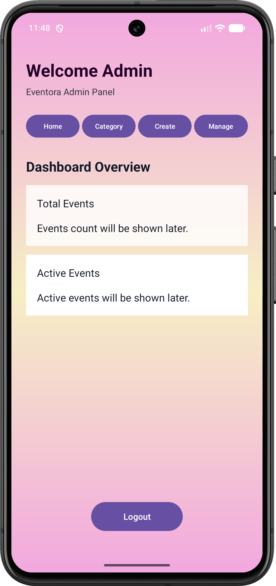

## Create Category page

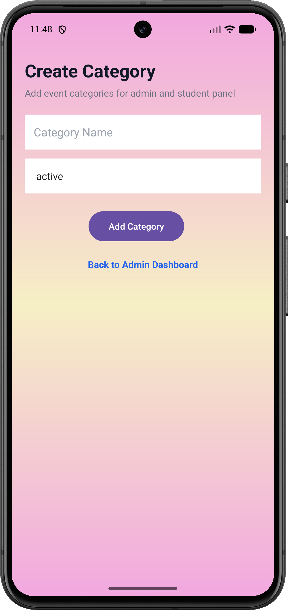

## Manage Category page

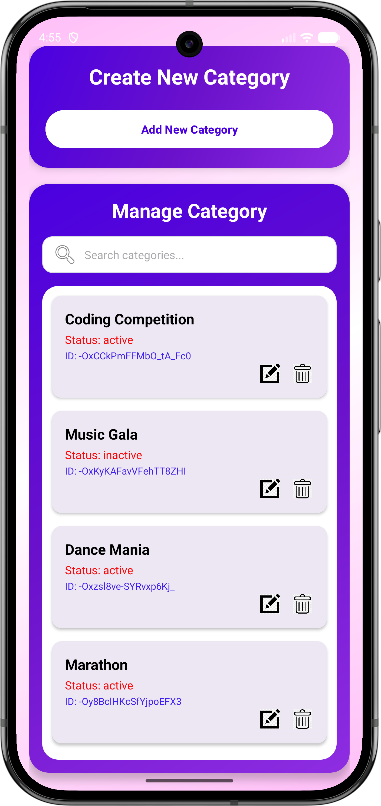

## Edit Category dialog

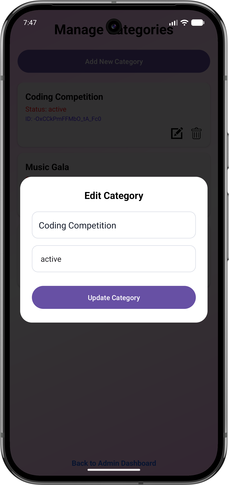

## Delete Category dialog

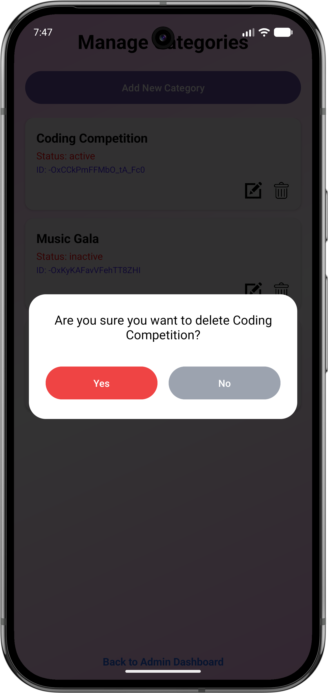

Note: to see the remaining screenshots and screenrecording go to "App/Screenshots".

